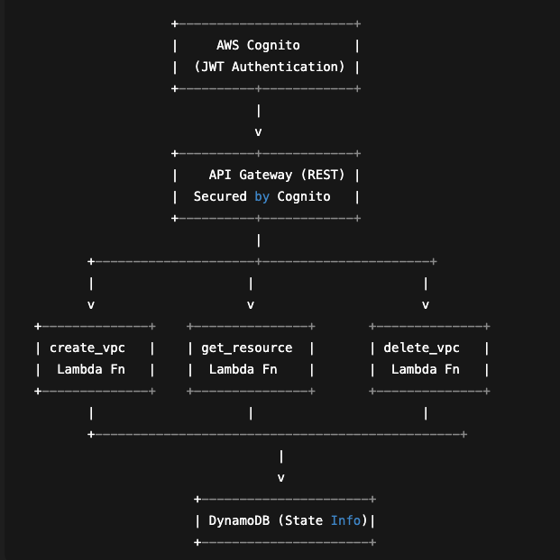
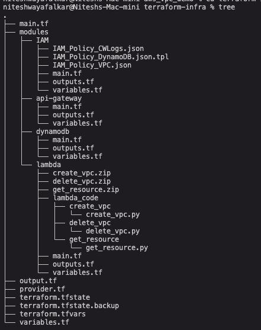

# 🏗️ AWS Serverless Infrastructure — Automated with Terraform

This project demonstrates a **fully automated Serverless Architecture** on AWS, built and managed entirely using **Terraform**.  
It provisions Lambda-based microservices, a secure API Gateway layer protected by **AWS Cognito authentication (JWT)**, and integrates all backend resources — ensuring full Infrastructure-as-Code (IaC) reproducibility.

---

## 🎯 Objectives

- Automate **end-to-end infrastructure provisioning** using Terraform.
- Create **modular and reusable Terraform components** for Lambda, API Gateway, DynamoDB, and IAM.
- Implement **REST APIs** using AWS API Gateway integrated with Lambda functions.
- Secure API Gateway endpoints using **AWS Cognito User Pool authorizers** with **JWT-based authentication**.
- Implement **state locking** and **remote backend** with S3 and DynamoDB for Terraform.
- Enable **environment-level separation** (dev, test, prod) using Terraform variables and workspaces.
- Ensure idempotent, version-controlled, and auditable infrastructure changes.

---

## 🧩 Architecture Overview

      

## Terraform automates provisioning of:

S3 bucket (backend)

DynamoDB (lock table + app data)

IAM roles/policies

Lambda functions

API Gateway (methods, integrations, authorizer)

Cognito User Pool & App Client


---

## ⚙️ Lambda Functions

| Function Name | Purpose | Trigger | File Path |
|----------------|----------|----------|------------|
| `create_vpc` | Creates a new VPC based on API request | POST `/create-vpc` | `modules/lambda/lambda_code/create_vpc/create_vpc.py` |
| `get_resource` | Fetches existing VPC or network resource details | GET `/get-resource` | `modules/lambda/lambda_code/get_resource/get_resource.py` |
| `delete_vpc` | Deletes the specified VPC and removes entry from DynamoDB | DELETE `/delete-vpc` | `modules/lambda/lambda_code/delete_vpc/delete_vpc.py` |

All three Lambda functions are packaged as `.zip` files using Terraform’s `archive_file` data source.

---

## 🔒 API Gateway & Cognito Security

### API Gateway
- **Methods:** `GET`, `POST`, `DELETE`
- **Integration Type:** Lambda Proxy
- **Deployed via Terraform**
- **Stage:** `dev`

### AWS Cognito
- Terraform provisions a **User Pool**, **User Pool Client**, and **Cognito Authorizer**.
- The authorizer is linked to all API Gateway methods.
- Users authenticate via Cognito and obtain **JWT tokens**, which are required for API access.

### Accessing the API with JWT Token

1. **Authenticate via Cognito:**
   ```bash
   curl -X POST https://<cognito-domain>.auth.<region>.amazoncognito.com/oauth2/token \
     -H "Content-Type: application/x-www-form-urlencoded" \
     -d "grant_type=password&client_id=<CLIENT_ID>&username=<USER>&password=<PASS>"
2. Extract the id_token (JWT) from the response.

3. Call API Gateway using the token:
## create_vpc
curl --trace-ascii trace_ascii.log -X  POST -H "Content-Type: application/json" -H "Authorization Bearer YOUR_TOKEN_HERE" 
-d ' {
           "cidr": "10.0.0.0/16",
           "subnets": ["10.0.1.0/24", "10.0.2.0/24"],
           "tags": {"env": "dev"}
        }' https://ocvghag1k5.execute-api.ap-south-1.amazonaws.com/vpcs
## get_resource
Fetch vpc_id from dynamodb_table: vpc-7ac0823b
https://ocvghag1k5.execute-api.ap-south-1.amazonaws.com/vpcs/vpc-7ac0823b

## delete_vpc
 curl --trace-ascii trace_ascii.log -X DELETE --H "Content-Type: application/json" -H "Authorization Bearer YOUR_TOKEN_HERE" 
  -d '{
  "resource_id": "vpc-2e34b1c3"
}' https://ocvghag1k5.execute-api.ap-south-1.amazonaws.com/vpcs 


🧠 Terraform Automation

The entire infrastructure is defined as code under the terrform-infra/ directory.

 # Implement Continuous integreation using Github Actions
 With Following stages:
 * terraform init
 * terraform fmt
 * terraform plan -var-file=terraform.tfvars
 * terraform apply -var-file=terraform.tfvars --auto-approve

🧰 Technologies Used
 | Category         | Tool/Service                                              |
| ---------------- | --------------------------------------------------------- |
| IaC              | Terraform                                                 |
| Compute          | AWS Lambda                                                |
| API Management   | Amazon API Gateway                                        |
| Authentication   | AWS Cognito                                               |
| State Management | S3 + DynamoDB                                             |
| IAM Policies     | Fine-grained JSON templates                               |
| CI/CD            | GitHub Actions (Terraform validate, plan, apply, destroy) |

✅ Outputs

After successful deployment, Terraform outputs:
| Output                 | Description                            |
| ---------------------- | -------------------------------------- |
| `api_gateway_url`      | Base endpoint for invoking REST APIs   |
| `cognito_user_pool_id` | Cognito User Pool for authentication   |
| `lambda_function_arns` | ARNs for all deployed Lambda functions |
